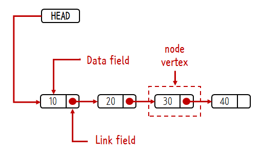
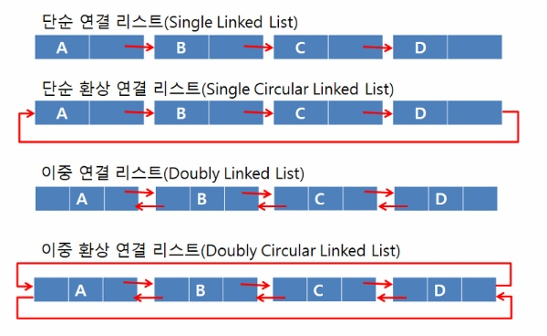

# LinkedList

LinkedList 는 이름 그대로 노드들이 연결되어 있습니다. ArrayList 와는 다르게 메모리에 선형으로 저장되지 않고, 임의의 공간에 저장됩니다. 그래서 순회하기 위해 노드는 다음 노드의 위치를 알고 있습니다.

## LinkedList 특징

1. 크기의 제한이 없습니다. 배열은 생성할 때 일정한 크기를 가지고 생성됩니다. 만약, 생성된 배열의 크기를 초과해서 데이터를 추가해야한다면, 새로운 배열을 다시 생성해서, 이전에 생성했던 데이터를 복사해주어야합니다. 반대로, LinkedList 는 포인터를 이용해 연결되기 때문에 데이터를 추가하고, 데이터가 저장된 포인터를 이전 노드에 알려주면 되기 때문에 크기에 대한 제한이 없습니다.
2. 추가, 삭제에 대한 작업이 용이합니다. 앞에 말한대로 포인터를 이용해 참조되기 때문에, 추가나 삭제가 발생했을 때 메모리 위치를 변경할 필요 없이 연결된 포인터가 변경하면됩니다.
3. 공간이 효율성이 ArrayList 보다 떨어집니다. 노드에 포인터를 저장해야하기 때문에, 더 많은 메모리가 필요합니다.
4. 검색이 ArrayList 보다 느립니다. 포인터를 통해 순회하기 때문에 찾기 위한 시간이 소요됩니다.

## LinkedList 구조

LinkedList 는 `head` 에서 순회를 시작하고, `next` 를 통해 다음 노드를 찾습니다. 그리고 `next` 값이 존재하지 않는다면, 순회를 마칩니다. 하지만 LinkedList 종류에 따라 순환하기도 합니다.

- head: 출입구로서, 첫번째 노드를 가르킵니다.
- value: 저장되는 데이터 필드입니다.
- next: 다음 노드의 포인터를 저장하여, 노드와 노드를 연결합니다.

## LinkedList 종류

- Single Linked List
- Single Circular Linked List
- Doubly Linked List
- Doubly Circular Linked List

## LinkedList Requirement

- [x] 사용자는 배열의 크기를 알 수 있다.(size)
- [x] 사용자는 하나의 데이터를 추가할 수 있다.(add)
- [x] 사용자는 특정 인덱스 데이터를 추가할 수 있다.(addAt)
- [x] 사용자는 인덱스에 위치한 데이터를 조회할 수 있다.(find)
- [x] 사용자는 하나의 데이터를 삭제할 수 있다.(remove)
- [x] 사용자는 특정 인덱스의 데이터를 삭제할 수 있다.(removeAt)
- [x] 사용자는 배열을 비울 수 있다.(clear)
- [x] 사용자는 배열이 비어있는지 확인 할 수 있다.(isEmpty)
- [x] 사용자는 입력된 데이터와 가장 먼저 일치하는 데이터의 인덱스를 찾을 수 있다.(indexOf)
- [x] 사용자는 배열에 입력된 데이터가 존재하는지 판단할 수 있다.(contain)

## References

- [생활코딩 자료구조](https://opentutorials.org/module/1335/8821)
- [ArrayList와 LinkedList란 무엇인가?](https://coding-factory.tistory.com/228)
