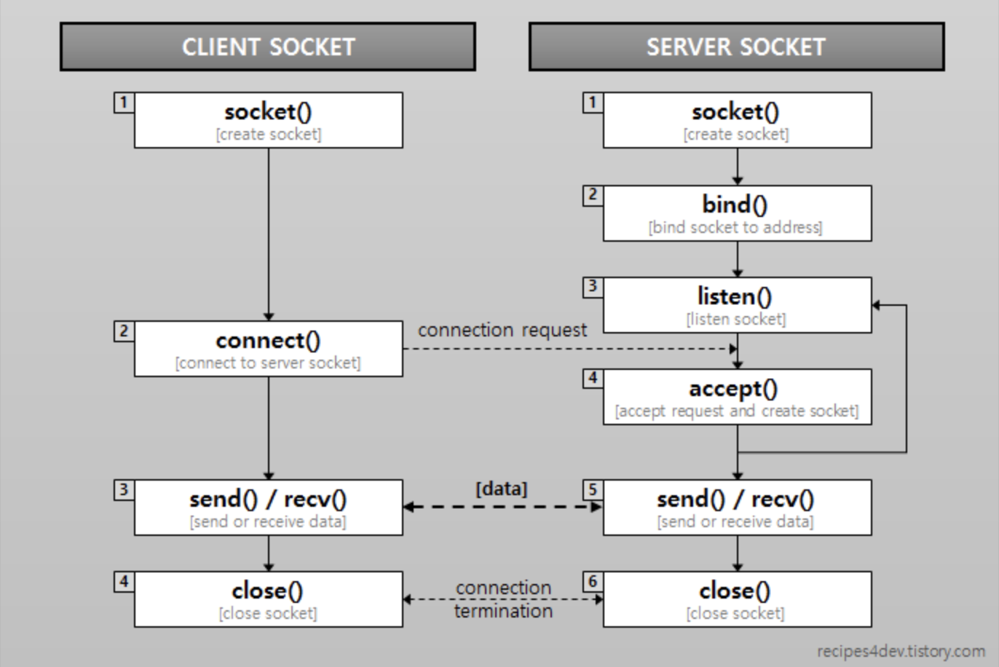

# Web SOCKET

## HTTP 문제

- 단방향 호출에 대해 응답하고 연결을 끊는다
- 높은 Overhead 를 가지고 있다
- 클라이언트는 Response 를 받기 위해서 매핑을 유지해야한다.

## Web Socket 이란?

- 양방향 통신을 한다
- Scheme - ws://(http) : wss://(https)
- 독립적인 TCP 기반 프로토콜이다.
- HTTP(80) 과 HTTPS(443)에서 동작한다.
- 프로토콜은 연결(handshake)과 데이터 전송(data transfer) 부분을 가지고 있다.

### Socket 종류

- TCP : 
- UDP

### Handshake

**HTTP Upgrade Request**

```
GET /chat HTTP/1.1
Host: server.example.com
Upgrade: websocket
Connection: Upgrade
Origin: http://example.com
Sec-WebSocket-Key: dGhlIHNhbXBsZSBub25jZQ==
Sec-WebSocket-Protocol: chat, superchat
Sec-WebSocket-Version: 13
```

- Upgrade : websocket 사용 요청. 항상 "WebSocket" 이라는 값을 가진다.
- Connection : 항상 "Upgrade" 라는 값을 가진다. 다른 값이면 cross-protocol attack 이라고 간주하고 접속과정을 중지한다.
- Sec-WebSocket-Key : 유효한 요청인지를 확인하기 위한 키. base64 로 인코딩한다(16byte)
- Sec-WebSocket-Protocol : 클라이언트에서 수용할 수 있는 서브프로토콜 리스트(어플리케이션 레벨). 출동방지를 위해 사용
- Origin : Cross Origin Resource Sharing 을 위해 사용

**Response**

```
HTTP/1.1 101 Switching Protocols
Upgrade: websocket
Connection: Upgrade
Sec-WebSocket-Accept: s3pPLMBiTxaQ9kYGzzhZRbK+xOo=
Sec-WebSocket-Protocol: chat
```

- Sec-WebSocket-Accept : 보안을 위한 응답 키(GUID 키를 생성하여, 클라언트 키와 결합한 후 SHA-1 해싱 후 Base64 로 인코딩 후 리턴한다)
- Sec-WebSocket-Protocol : 서버에서 선택한 서브프로토콜(지정하지 않을 수 있다.)
- status code 가 101 이 아니라면, 소켓 연결이 되지 않은 상태이다.


## Web Socket Lifecycle



websocket 프로토콜로 업그레이드

### Server

**Bind**

아이피 주소와 포트 번호를 결합하여 연결한다.

**Accept**

클라이언트 접속 허용한다. 내부적으로 하나의 소켓을 생성한다.


### Client

**연결요청**

## Web Sockert 예외 처리

- 케이블 분리로 인한 네트워크 단절
- 트래픽 증가에 따른 데이터 전송 지연
- 시스템 리소스 관리 문제로 인한 에러

네트워크 환경에서 발생할 수 있는 다양한 예외사항에 대한 처리가 필요하다.

## Websocket Interface

```
WebSocket WebSocket(
  in DOMString url,
  in optional DOMString protocols
);

WebSocket WebSocket(
  in DOMString url,
  in optional DOMString[] protocols
);
```

- url: 연결할 URL 주소(port 포함)
- protocols: subprotocol
- https://developer.mozilla.org/ko/docs/Web/API/WebSocket

## References

- [소켓 프로그래밍 기초](https://jihooyim1.gitbooks.io/unixbasic/contents/11.html)
- [소켓 프로그래밍](https://recipes4dev.tistory.com/153)
- [실시간 서비스 경험기(배달운영시스템)](https://woowabros.github.io/woowabros/2017/09/12/realtime-service.html)
- [The WebSocket Protocol](https://tools.ietf.org/html/rfc6455)
